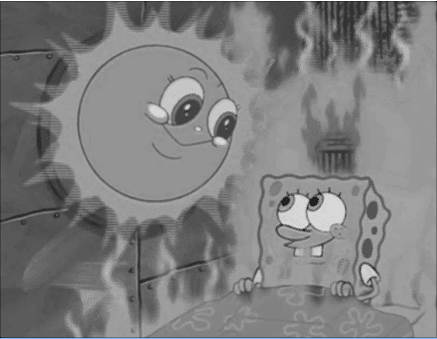

# Taller de procesamiento de imágenes
Práctica de procesamiento de imágenes para la asignatura Computación Visual.
## Integrantes

|       Integrante      |                 github nick                   |
|-----------------------|-----------------------------------------------|
| Nicolai Romero         | [anromerom](https://github.com/anromerom) |
| Julian Rodriguez      | [jdrodriguezrui](https://github.com/jdrodriguezrui)       |
| Edder Hernández      | [Heldeg](https://github.com/Heldeg)       |
## Introducción
En este taller se manipulan las imágenes mediante varias técnicas para obtener diferentes resultados. Estas son las imágenes que se logran obtener después de aplicar el debido procedimiento:
-	Imagen en escala de grises
-	Imagen con efecto de difuminado
-	Imagen en formada con caracteres ASCII

Adicionalmente, la transformación de ASCII es aplicable a videos. Por otro lado, en el cuadro donde se muestra el resultado, se dibuja un histograma que representa la luminosidad de la imagen original.

## Motivación
El procesamiento de imágenes es, en la actualidad, una práctica común. Programas editores de imágenes o videos muestran que es fácil para el usuario aplicar alguna transformación a la imagen -en el amplio sentido de la palabra- para obtener otra. Es de esta forma que es ampliamente conocido que es posible tomar una imagen y volverla a escala de grises, o desenfocarla.

Con la resolución de este taller podemos entender la idea con la que estos algoritmos manipulan el mapa de bits para retornar el resultado deseado. De esta forma ganamos entendimiento en cuanto al funcionamiento de las imágenes digitales y los medios de trabajar con estas. 

## Objetivo

Crear un sistema de software que permita recibir imágenes y videos, procedentes de la carpeta data, para posteriormente seleccionar una transformación, y, de esta manera, producir otra representación, visible al lado de la figura original.
## Metodología

### Escala de grises
Hay dos formas en que se logra este efecto. El primero consiste en hacer un promedio entre los canales RGB para obtener el valor del píxel en escala de grises. El segundo método es llamado luma, la principal diferencia es que el promedio que se hace a los canales es ponderado, dando una prioridad al canal verde, seguido del canal rojo, y teniendo el canal azul con una menor importancia, como se puede apreciar a continuación:  0.2126R + 0.7152G + 0.0722B.
### Desenfoque
Para la generación de efecto borroso en la imagen, se implementó un desenfoque que consiste en promediar los componentes R, G y B de los píxeles en las cercanías para hallar el valor de los componentes del píxel central. Este procedimiento se ejecuta para cada píxel. En caso de encontrarse en el borde de la imagen, se realiza un efecto espejo en el que al intentar leer un píxel fuera de los límites de la imagen cierta distancia se lee un píxel existente dentro de los límites de la imagen esa misma distancia. Se puede entender el algoritmo en otros términos como una convolución entre la imagen y un kernel de tamaño k cuyos componentes son todos 1/k^2
### Detección de bordes
Por su lado la detección de bordes consiste en el resaltado de puntos importantes de una imagen. Es una aplicación muy extensa del procesamiento de imágenes, de forma que existen varios algoritmos que aplican varias capas de convolución con el propósito de dar bordes cada vez más precisos. 

Pero en resumidas cuentas se puede obtener con la aplicación de una mascara convolucional. Las técnicas están fuertemente basadas en la obtención de gradientes de la imagen.
### Inversión de colores
Invertir colores consiste en calcular el color complemento para cada píxel. Esto se logra restando a 255 el valor que tenga cada canal RGB.

### ASCII
El proceso de transformar una imagen consta de tres partes. Primero, a cada carácter de ASCII se le asigna un valor referente a luminosidad dependiendo de la complejidad del carácter, es decir, del número de trazos que tenga. El paso por seguir es pixelar la imagen original para promediar fácilmente las áreas de la imagen. Finalmente, con ayuda del algoritmo de luma, se obtiene el valor de luminosidad para cada píxel y este es relacionado con el carácter que mejor coincida su valor.

### Aspectos a tener en cuenta
El proyecto cuenta con cuatro ejecutables, dos para el procesamiento de imágenes y dos para el procesamiento de video. Un ejecutable de imagen y otro de video hace los procesamientos de forma clásica, mientras que los otros dos ejecutables hacen procesamiento con ayuda de hardware.

## Resultados 

 
## Conlusiones
